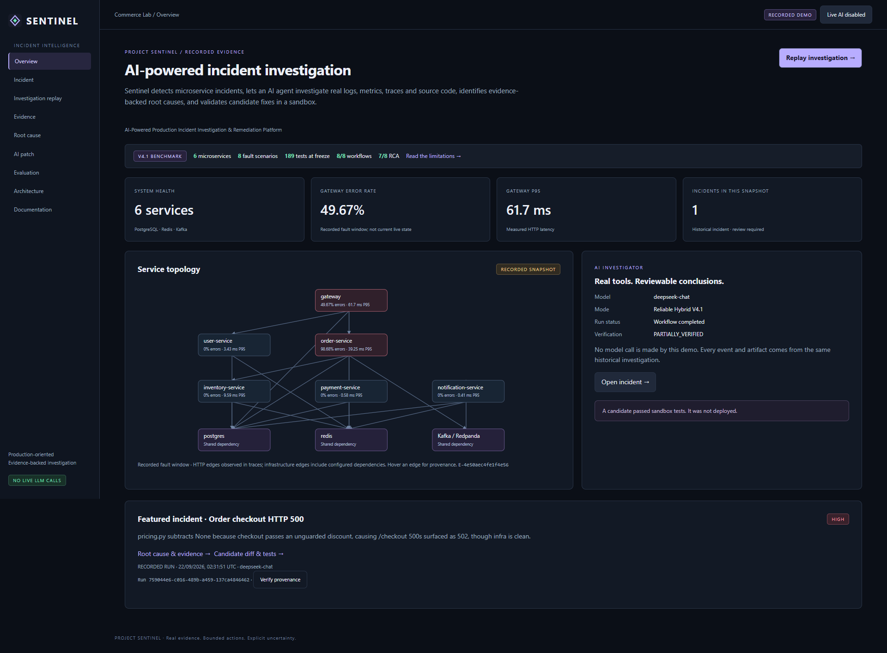
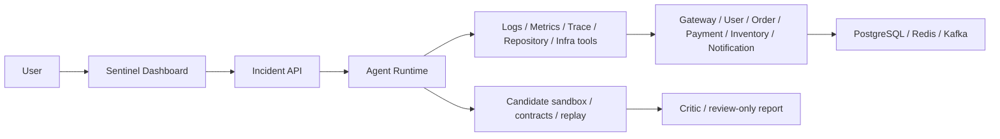

# Project Sentinel

**AI-Powered Production Incident Investigation & Remediation Platform**

Sentinel detects microservice incidents, lets an AI agent investigate real logs, metrics, traces and source code, identifies evidence-backed root causes, and validates candidate fixes in a sandbox.

AI 驱动的微服务生产事故调查与自动修复平台。Production-oriented engineering portfolio; **not production ready**.

**Incident → Tool Calling → Evidence → Root Cause → Candidate Patch → Sandbox Validation.**

**Frozen V4.1:** 8 fault scenarios · **8/8 workflow completion** · **7/8 (87.5%) root cause accuracy** · Model: **deepseek-chat**. Eight controlled cases, not a production accuracy estimate.

**Tests:** V4.1 benchmark-time gate **189 passed**; independent audit regression suite **287 backend + 17 frontend passed**, plus **37 browser checks and 42 Public HTTP checks**. These are separate test suites, not 287 live-model cases.

**Benchmark performed on frozen V4.1 build.** Current audit fixes are unbenchmarked. The Critic evidence guard now retains mandatory citations or fails explicitly; offline historical repacking fits six cases and exceeds the original context budget in two. See the [independent final audit](docs/independent-final-audit.md) and [Claims Matrix](CLAIMS_MATRIX.md).

**Explore:** [Recorded Demo](#recorded-demo) · [Architecture](docs/architecture.md) · [Evaluation](docs/phase4-evaluation.md) · [Quick Start](#quick-start).

**Start here:** [30-second introduction](docs/pitch-30s.md) · [5-minute demo](docs/demo-5min.md) · [Final status](FINAL_STATUS.md).



**Try it locally without an API key:** `docker compose up -d --build` → [Local Recorded Demo](http://localhost:18082). First build requires Docker and internet for dependencies. No Kafka, database or model service is started by the default demo.

## Key Results — V4.1 Benchmark

| Metric | Frozen result |
|---|---:|
| Fault scenarios | 8 |
| Workflow completion | 8/8 |
| Root cause accuracy | 7/8 (87.5%) |
| Service localization | 7/8 |
| Workflow tokens | 1,461,870 |
| Mean workflow duration | 78.75 seconds |
| Model | deepseek-chat |
| Phase 4 test gate | 189 passed |

One first dispatch per scenario. Retry storm remains incorrect. All eight Critic verdicts are **PARTIALLY_VERIFIED**. Tokens exclude Evaluator; cost is Unknown without configured prices. This small controlled benchmark is not a production accuracy estimate.

## Architecture



The public demo deploys only Dashboard + read-only API + recorded files. The full local lab has six microservices and real telemetry dependencies. [Local Architecture page](http://localhost:18082/architecture.html).

## How It Works

A controlled fault produces real HTTP failures, logs, metrics, distributed spans and dependency observations. The Agent investigates through constrained tools; evidence IDs and read citations connect claims to observations. A code candidate is tested against immutable contracts and real service replay before review.

## Agent Workflow

Incident → Triage → Planner → Tool → Evidence → Hypothesis → Validation → Root Cause → Eligibility → Candidate → Tests / Replay → Critic → Report.

Errors enter durable state, bounded repair and checkpoint recovery. This is more than Prompt → LLM → Answer. No generic candidate is automatically deployed.

## Fault Lab

The local lab implements PostgreSQL slow queries, connection-pool exhaustion, N+1, cache miss pressure, Kafka consumer lag, downstream timeout, retry storms and HTTP 500 code exceptions. Faults can be triggered and stopped; registry/ground truth belongs to the evaluator, not the Investigator.

## Evaluation

| Version | Workflow | Root cause | Notes |
|---|---:|---:|---|
| Rule | 8/8 | 7/8 | Domain-specific predicates |
| V1 Pure LLM | 8/8 | 5/8 | First baseline |
| V2 Hybrid | 8/8 | 6/8 | Triage + model investigation |
| V3 Context Optimized | 2/8 | 1/8 | **FAILED EXPERIMENT / RUNTIME RELIABILITY FAILURE** |
| V3.1 Runtime Experiment | 1/8 | 1/8 | **FAILED EXPERIMENT / RUNTIME RELIABILITY FAILURE** |
| V4 First Controlled | 7/8 | 5/8 | Two fixture-confounded trials retained; excluded from Pareto |
| V4.1 Reliable Hybrid | 8/8 | 7/8 | Independent benchmark-v2 release cohort |

V4.1 is not a single-variable compression ablation: runtime and readable business source changed. It still consumed about 1.46M tokens. Accuracy, cost, latency and reliability trade off. Rule is strong in this fixed domain; the latest version is not automatically best on every axis.

[Local Evaluation page](http://localhost:18082/evaluation.html) · [Full methodology and open findings](docs/phase4-evaluation.md).

## What Failed

V3 context optimization caused workflow completion to collapse. Context reconstruction lost correction feedback; structured output recovery was insufficient; convergence removed evidence tools too early; budget accounting and telemetry pressure exposed more failures. V3.1's first intervention also failed. Separate qualification reached 5/5 before V4, but never replaced first results.

Explicit state, pinned errors, read tracking, separate budgets, bounded repair and measured telemetry improved the final workflow result. Independent inspection found that frozen Critic inputs omitted some root-cited evidence in all eight cases, and the readable fault helper reveals experiment implementation. The post-freeze guard rejects silent omission and undelivered citations; current workflow completion has not been rebenchmarked. Historical failures are retained, not hidden or rescored.

## AI Patch

Four constrained function profiles: pricing, payment, order and inventory. Real model component follow-up: 4/4 candidates validated, with earlier failures retained. The featured V4.1 pricing candidate passed nine contract tests and changed eight identical failing inputs from 100% to 0% HTTP 500 in a three-service sandbox with real PostgreSQL/Redis/Kafka.

**CANDIDATE PATCH · NOT DEPLOYED.** Financial logic is HIGH risk. Successful requests did more work, so the measured P95 increased; this is not a latency optimization claim.

## Runtime Reliability

Typed investigation state, hypothesis transitions, six budgets, citation registry, bounded schema repair, repeated-failure circuit breaker, public-response journal and tool receipts. Real SIGKILL/exit 137 and same-run resume were tested. Protocol fixtures exercise 429/500/invalid JSON/timeouts without pretending they are cloud incidents. A response lost before commit may still be billed twice.

## Quick Start

Requires Docker Engine with Compose v2 / Docker Desktop. Clone this repository and start the recorded demo locally:

```sh
git clone https://github.com/tangwencan666/Project-Sentinel.git project-sentinel
cd project-sentinel
cp .env.example .env
docker compose up -d --build
```

Windows PowerShell: use `Copy-Item .env.example .env` instead of `cp`. The `.env` copy is optional for Recorded Demo. Existing credentials are never needed or forwarded to the public image. Open http://localhost:18082.

Optional environment check (Python 3.10+ on host):

```sh
python scripts/check_environment.py --mode recorded
```

If port 18082 is occupied, set `DEMO_PORT=18084` and open that port. First build requires package downloads; later starts use the built image. Stop only this demo with `docker compose down`; do not remove lab volumes.

## Recorded Demo

The default homepage labels all observations **RECORDED DEMO**. The featured run is `759044e6-c016-489b-a459-137ca4846462`, recorded 2026-09-22 UTC, model deepseek-chat. Play / Pause / Restart / 1× / 2× / 4× / Skip to Root Cause change only the playback cursor.

Original events, evidence, diagnosis, patch and tests come from that same Run. Exact fault-trigger time was not persisted; the UI shows the actual first fault observation and operator-requested incident creation. Summary loads first, raw evidence on demand. Public projections and SHA256 provenance live in `portfolio/data/`; original internal experiment archives remain local and excluded from Git.

## Live Mode

The existing full lab is preserved in `compose.live.yaml` on port 18083. Configure `.env` with your provider URL, model and API key, then explicitly set `LIVE_AI_ENABLED=true`:

```sh
docker compose -f compose.live.yaml up -d --build
```

Open http://localhost:18083/live.html. With the default false, controls, detector dispatch and automatic resume are disabled; telemetry remains readable. Live mode can spend real model tokens and inject actual faults. Do not expose this stack publicly. Phase 5 does not rerun a paid benchmark.

## Security

`PUBLIC_DEMO_MODE=true` runs a separate no-DB/no-provider server. All mutations are rejected. The minimal image has no secret mounts, tool dispatcher, live agent, database driver or Docker socket; it is non-root and filesystem read-only. Logs, traces and source are rendered as escaped untrusted text. [Public deployment and limits](docs/deployment-public-demo.md).

The audit fixed inconsistent symlink checks and the public page path gate, and rejects byte-range requests before the pinned Starlette Range parser. Dependency advisory debt remains; this is not a claim that every dependency or Docker image is vulnerability-free. See the [security assessment](docs/independent-final-audit.md#security).

## Limitations

- Eight controlled scenarios, one formal first dispatch each; no statistical generalization or production SLO claim.
- Frozen V4.1 retains the Critic handoff defect. Current code has a required-citation guard; oversized mandatory evidence bundles fail explicitly. No new 8/8 result is claimed. Experiment-helper visibility remains.
- Four constrained patch profiles, shared sandbox kernel, no arbitrary-repository remediation or live generic Apply.
- No live multi-tenant RBAC or distributed execution leases; no end-to-end exactly-once billing.
- Public Demo displays history, not a continuously operating commerce deployment. No public domain has been purchased or deployed.

## Local verification (no paid benchmark)

The full backend tests need the local lab dependencies, with `LIVE_AI_ENABLED=false`:

```sh
docker compose -f compose.live.yaml up -d --build
python scripts/test_phase5.py --output backend-local.json
npm ci
npm test
# Linux/macOS: npx playwright install chromium
npm run test:e2e -- browser-local.json
python scripts/audit_portfolio.py --output repository-local.json
```

Browser tests use installed Edge on Windows, Playwright Chromium elsewhere; set
`PLAYWRIGHT_CHANNEL` if needed. `SENTINEL_DEMO_URL` changes the recorded demo URL.
Use new result names: audit/test scripts preserve prior evidence. The public demo
needs no Node dependency; Node/Playwright are development test tools only.
The backend gate uses the included genuine `portfolio/data/` recording
for the historical 90-span trace regression; internal experiment archives are no
longer required by that test. Frontend verification adds 17 local tests: seven replay
tests and ten document-rendering/security tests. The document reader supports section
links, tables, screenshots and original Markdown downloads without interpreting HTML.
The historical phase-one to phase-four evaluation scripts reference their frozen lab
layout and local experiment archives; they are not the Phase 5 quick-start path.
Do not run them to reproduce the portfolio display or refresh screenshots.

## Project Structure

```text
sentinel/          # Existing agent runtime + isolated public read-only API
services/          # Six-service commerce lab
web/               # Portfolio UI, playback, preserved local Live workspace
portfolio/data/    # Sanitized genuine recordings + provenance manifest
infra/             # Local SQL, metrics and tracing configuration
tests/             # Runtime, contracts, public API and security tests
scripts/           # Export, environment validation, audits and browser tests
docs/              # Design, screenshots, demo scripts and interview materials
compose.yaml       # Default minimal recorded demo
compose.live.yaml  # Explicit local full-stack lab
```

## Documentation

**Recruiter path:** this README → [Screenshot](docs/screenshots/dashboard.png) → [Architecture in five minutes](docs/architecture-cheatsheet.md) → [Demo](docs/demo-5min.md) → [Evaluation](docs/phase4-evaluation.md) → [V3 failure story](docs/v3-failure-story.md).

**Developer path:** [Quick Start](#quick-start) → [Architecture](docs/architecture.md) → [Agent design](docs/agent-design.md) → [Fault Lab](#fault-lab) → [Evaluation](docs/phase4-evaluation.md) → [Tests](#local-verification-no-paid-benchmark). Full local lab and recorded public deployment have separate entry points.

[30-second pitch](docs/pitch-30s.md) · [1-minute pitch](docs/pitch-1min.md) · [3-minute pitch](docs/pitch-3min.md) · [10-minute technical demo](docs/demo-10min.md) · [49 interview questions](docs/interview-qa.md) · [24 hard questions](docs/interview-hard-questions.md) · [Interview depth map](docs/interview-depth-map.md).

[中文 / English resume](docs/resume.md) · [Three-bullet resume](docs/resume-short.md) · [Actual tech stack](docs/tech-stack.md) · [Limitations](docs/limitations.md) · [Future work — not implemented](docs/future-work.md) · [Public deployment](docs/deployment-public-demo.md) · [Final delivery audit](docs/final-portfolio-audit.md) · [Phase 5 acceptance](docs/phase5-acceptance.md).
