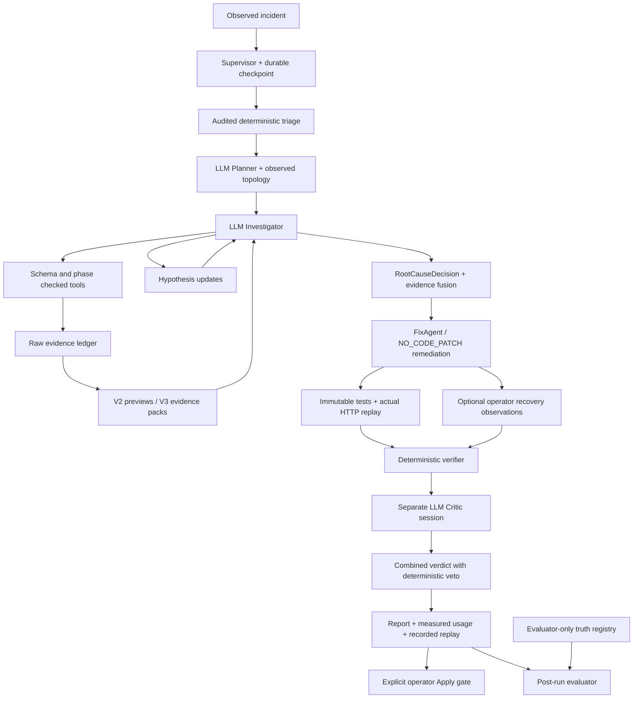

> Historical design note. Current Phase 4 runtime, compiler, generic sandbox and recovery evidence are documented in [phase4-runtime.md](phase4-runtime.md), [phase4-generic-patching.md](phase4-generic-patching.md) and [phase4-recovery-security.md](phase4-recovery-security.md).

# Hybrid SRE Agent architecture

V1 的原始设计与结果保留在 `evaluation/baselines/archive.zip`。当前支持 RULE_BASED、AI（Pure LLM）、HYBRID_V2、HYBRID_V3 四种显式模式。依据第三阶段实测，默认新调查使用 V2；V3 保留为显式实验模式，没有静默回退。精确实验源码保存在 `evaluation/frozen-framework.zip`。

## Evidence and planning

`run_deterministic_triage` 调用同一受控工具注册表，采集 HTTP/Prometheus、SQL 差分、Redis 状态、Kafka 两次 offsets、连接池状态和真实 Trace。它只产生 advisory signals，每条绑定 Evidence ID；不输出根因类别，不读实验标签。健康 HTTP 不足以排除异步积压或缓存失效。

Topology 保留 observed_span 的 Trace/span 引用；共享 PostgreSQL/Redis 以及 producer/consumer 边标记为 configured，不能冒充观测。pricing 是 order-service 内部函数。上下游工具只基于这个图返回邻接关系，采样未见边不代表边不存在。

Planner 是独立轻量模型调用，输出 `InvestigationPlan` 的 suspected_services、initial_hypotheses、tool_priority、stop_conditions。计划只给方向。Investigator 从现有证据开始，继续使用实际工具、记录假设，并通过 `submit_root_cause_decision` 提交融合结果。

`RootCauseDecision` 包含原有 Diagnosis、supporting_evidence、contradicting_evidence、deterministic_signals、llm_findings 和 remaining_uncertainty。必须引用本 run 的有效证据，至少两个独立类型；Trace/detail、source/symbol/context 不重复计为独立来源，triage/topology 也不充当独立原始来源。代码行引用必须落在实际读取过的范围。

这里的“独立”是证据来源族去重，不是统计或因果独立性的证明：例如 HTTP 日志和窗口指标可能来自同一批请求。相关观测互相印证有价值，但不能把它们当成完全独立实验。

## Stop, context and accounting

V2 使用有上限的原始预览，V3 对日志模板、指标窗口、Trace 关键部分、函数源码做预算压缩。详见 `context-engineering.md`。证据达到标准时直接进入验证；接近预算上限时强制模型输出结构化假设或最终判断，仍允许 UNKNOWN 和不确定性，证据门禁保持有效。限制为 12 个 Investigator 回合、28 次工具请求、每批最多 6 次，整体 480 秒。失败保留，不静默退回规则答案。

每次工具调用记录角色、参数、起止时间、状态、Evidence ID。Triage、Supervisor、RecoveryObserver、TestAgent、Critic 都计入完整工作流，不冒充 Investigator 的自主调用。模型调用保存 Provider 实际用量；字符估算单列。规则基线与评分器不作为 AI 调查推断。

## Verification and patches

确定性门禁检查引用、独立来源、服务出现在拓扑与引用中、信号处理、声明的矛盾、Patch 相关性、真实测试/重放和观测来源。服务出现检查只证明结构一致性，不能证明正确归因。Critic 独立上下文包含事故、证据、根因、Patch、测试和 Before/After；同一个模型的独立会话并不保证独立可靠性。

若 deterministic FAIL 而 LLM VERIFIED，最终必须 PARTIALLY_VERIFIED，保留两层结果和 disagreement。NO_CODE_PATCH 输出操作建议；实验控制端停止故障并采集恢复窗口，不计为 AI repair。代码候选继续使用精确 diff、AST 限制、不变的 9 项定价合同测试及 baseline/candidate 各 20 次 HTTP 重放。当前安全执行范围仍仅 pricing，其他服务通用 Patch 未完成。

Patch 风险分类依据文件数、LOC、数据库、并发、基础设施及 API Contract。所有 AI 候选都需要操作员明确 Apply；HIGH 不自动部署。模型没有任意 shell、SQL、文件写入、故障控制或环境读取能力。

## Persistence and boundaries

Checkpoint 保留状态、对话、工具批次与游标。成功工具在数据库落盘后可以复用，进程重启恢复相同 run，失败后可显式 Resume；模型响应尚未落盘等边界不具备 exactly-once。实际重启测试的成功与失败都保存在 `evaluation/resume-*.json`，不因证据保留就宣称后续工作流完成。详见 `reliability.md`。

Investigator 的工具图不导入 scenarios/evaluator。故障和评估数据只向操作员 API/页面开放，终态后才进入评分器。源码 allowlist 不包括混有故障控制逻辑的 app.py。当前是能力隔离，不是独立操作系统/进程边界。Evaluator、场景定义、业务实现、定价合同测试与 V1 冻结版本的字节哈希保持相同。
