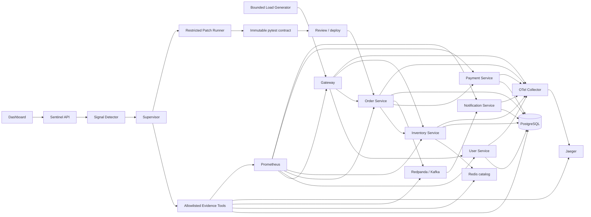

> Historical design note. Current Phase 4 runtime, compiler, generic sandbox and recovery evidence are documented in [phase4-runtime.md](phase4-runtime.md), [phase4-generic-patching.md](phase4-generic-patching.md) and [phase4-recovery-security.md](phase4-recovery-security.md).

# Architecture / 实现决策

## 事故与证据

检测器每 8 秒检查最近 20 秒的请求（至少 5 次）、5xx >10%、p95 >1s、Kafka lag >20 或 Inventory DB QPS >5。阈值是可解释的演示阈值，不是假装训练得到的异常模型。90 秒内全局去重，后续需要按 service/symptom 指纹去重。无异常时保留最近健康窗口作为基线，启动即故障可能没有基线。

日志包含真实 trace_id；HTTPX 自动传播 HTTP 上下文，Kafka message 显式携带 W3C trace context，消费者恢复 parent。SQL 使用独立四连接业务池；日志使用额外审计池，确保池耗尽时仍有证据。日志持久化失败记录 stdout 错误，不能假装没有观测丢失。

第二阶段 Supervisor 最多 18 轮、40 次 Investigator 工具调用，每个批次最多 8 次；普通工具时限 25 秒，模型请求时限 45 秒，完整 AI 工作流时限 480 秒。受控恢复实验可进入 awaiting_recovery，再将真实前后观测交给 Critic。缺少配置为 awaiting_model，失败保留结构化错误；重启标记 interrupted，重试创建新 run，尚无精确 durable task resume。角色、契约、上下文和 token 上限详见 agent-design.md。

## Ground truth 边界

`sentinel/scenarios.py` 是操作/评估面；包含注入说明、真值与预期证据。Dashboard `/api/scenarios` 只输出操作标签。事故 signal 来自遥测，不包含 scenario_id。模型工具只允许固定 SQL、catalog TTL、offset 查询和 pricing 源码，不允许 Redis 枚举、任意 SQL、任意文件、shell、控制 API 或故障注册表。调查器没有 evaluator 工具。

这是模型能力层面的隔离，不是多租户系统的物理隔离：控制面与工具同进程，仓库管理员仍可读取真值。生产隔离需拆控制/实验/调查服务与凭据。调查数据库账号只读且只有业务/日志表 SELECT，不能读取 incidents 或 agent_steps，也不能改业务表。

## Patch 边界

AI FixAgent 生成真实 Unified Diff；第一阶段人工提交完整源文件的入口保留，来源标记 HUMAN，规则补丁标记 RULE_BASED。AST 只允许单一 total 函数及受限表达式；无 import、属性访问、任意函数调用、循环或文件/网络 API。原版和候选分别复制到独立测试目录。CPU、内存、输出与超时约束保护单元测试执行。候选随后接受真实 HTTP 故障重放与 Critic 检查。源码基础哈希必须匹配；用户确认部署时再校验 AST、工件哈希、candidate_verified 与 Critic VERIFIED。

`repair:pricing` 保存已审核候选；订单服务每次请求读取并验证。运行验证不能通过“顺手停止故障”取得成功：要求原始 reproducer 仍开启。这个机制适合演示受限修复闭环；不替代通用容器沙箱、Git patch review、构建与发布系统。

## 参考

- OpenTelemetry Python exporters: https://opentelemetry.io/docs/languages/python/exporters/
- FastAPI instrumentation: https://opentelemetry-python-contrib.readthedocs.io/en/latest/instrumentation/fastapi/fastapi.html
- Redpanda single-broker Compose: https://docs.redpanda.com/labs/docker-compose/single-broker/
